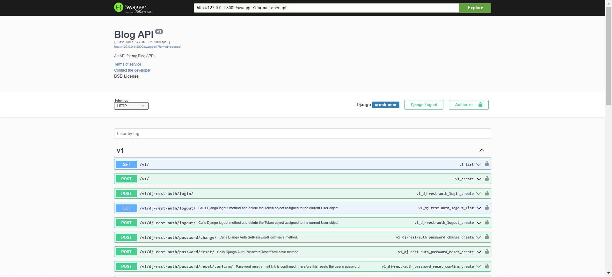
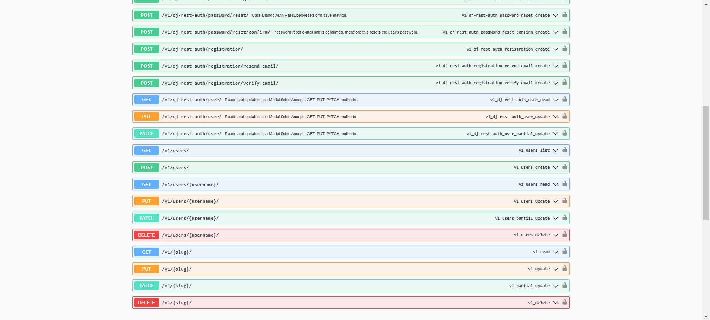

# BLOG API

In this api, I have added CRUD functionality to the Blog application. Only authenticated users can read the blogs as I have set the defualt permission to 'IsAuthenticated'. But the author has all the privilages. He can edit and delete the blog anytime.

API ENDPOINTS:

|Endpoint |HTTP Verb|
|--------------------------------------|---------|
|/ |GET |
|/:slug/ |GET |
|users/ |GET |
|users/:username/ |GET |
|/rest-auth/registration |POST |
|/rest-auth/login |POST |
|/rest-auth/logout |GET |
|/rest-auth/password/reset |POST |
|/rest-auth/password/reset/confirm |POST |


The compelete documention is available on http://127.0.0.1:8000/swagger/ or http://127.0.0.1:8000/redoc/

## Installation instructions:

1. Installation: Ensure you have Django installed. If not, you can install it using pip:
```
pip install Django
```

2. Clone the Repository: Clone this project's repository to your local machine.
```
git clone https://github.com/arunkumar02042002/blog_api.git
```

3. Database Setup: Configure your database settings in the project's settings.py file.Run migrations to create the necessary database tables:

```
python manage.py makemigrations
python manage.py migrate
```

4. Run the Development Server: Start the Django development server:
```
python manage.py runserver
```

5. Access the Application: Open your web browser and navigate to http://127.0.0.1:8000/swagger/ or http://127.0.0.1:8000/redoc/ to access the complete documention and enpoints.

The Above endpoints will look something like this.





Note: *I'll add the filteration, paginations, tagging features soon.*

## Contributing
Contributions are welcome! If you would like to enhance or expand upon this project, please fork the repository and submit your pull requests.

## License
This project is open-source and available under the NO License. Feel free to use, modify, and distribute it as needed.

## Contact
For any questions or feedback, please contact [Arun Kumar](arun.kumar.2403gg@gmail.com).